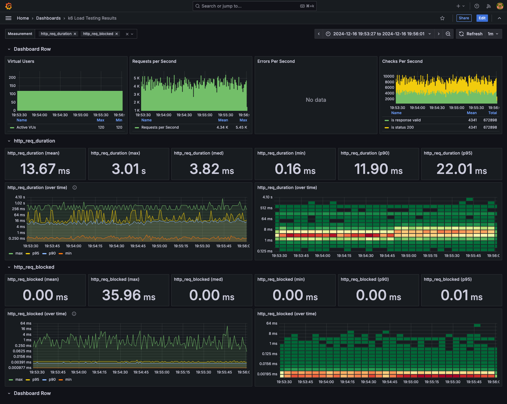

# Performance Testing

## Ingestion Service

To run the Ingestion Service performance test

1. Uncomment the Performance Testing services in the root `docker-compose.yml`.
2. Set up the Grafana Dashboard
   1. Set up the InfluxDB Data Source (user: admin, password: admin)
   2. Set up the K6 Dashboard (Dashboard ID: `2587`)
3. Navigate to the Performance Test directory: `cd 5_performance-tests`
4. Install the dependencies: `npm i`
4. Run `npm test` or `k6 run --out influxdb=http://localhost:8086/k6db k6_ingestion_test.js`

